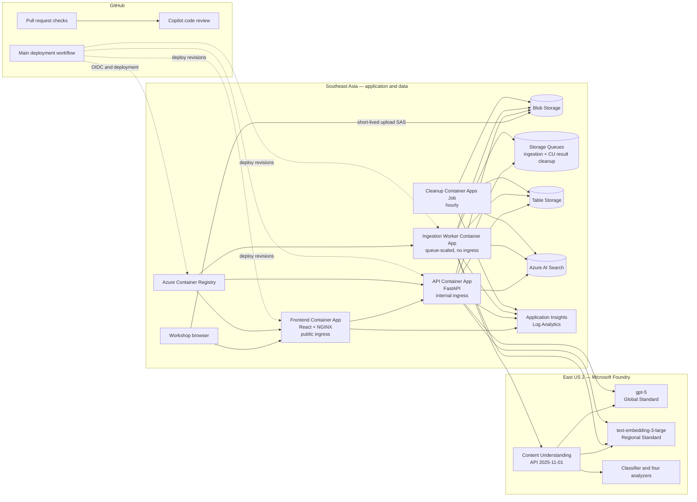

# Content Understanding RAG Demo — Design Specification

**Date:** 2026-09-03

**Status:** Approved through section-by-section design review

**Target repository:** `content-understanding-rag-demo` (public)

**Primary audience:** English-language workshop participants

**Workshop title:** *Content Understanding Meets GitHub Copilot: Build and Ship an Intelligent Document RAG App*

## 1. Executive summary

Build a public workshop application that accepts mixed business documents, extracts structured information with Azure Content Understanding, indexes source-grounded chunks in Azure AI Search, and answers questions with retrieval-augmented generation (RAG).

The user experience is an English-language **Technical Console**. It exposes upload progress, ingestion stages, extracted JSON and Markdown, retrieval diagnostics, streamed answers, and citations. The application supports PDF, DOCX, PPTX, PNG, and JPEG files up to 100 MB.

The application and persistent data plane run in **Southeast Asia**. Microsoft Foundry, Content Understanding, `gpt-5`, and `text-embedding-3-large` run from a Foundry resource in **East US 2**. Runtime Azure access uses managed identities and Microsoft Entra ID. The browser receives only short-lived, blob-scoped user-delegation SAS tokens for direct uploads; no account keys or AI API keys are used by the application.

`gpt-5` is the application runtime model. The request to use **Claude Opus 4.8** applies only to the coding agent used to author and review container, deployment, workflow, and IaC work when that model is available in the development environment; it is not deployed as an application dependency.

This is a workshop demo for up to 20 users, not a production multitenant service. Anonymous sessions isolate retrieval and expire after 24 hours.

## 2. Goals

1. Demonstrate mixed-document ingestion through the Content Understanding API.
2. Demonstrate classification and category-specific extraction for general business documents, invoices, receipts, and contracts.
3. Demonstrate vector and hybrid retrieval with Azure AI Search.
4. Demonstrate grounded, streamed answers from `gpt-5` with verifiable citations.
5. Demonstrate Azure Container Apps for the frontend, API, ingestion worker, and scheduled cleanup.
6. Demonstrate keyless Azure access with managed identities and least-privilege RBAC.
7. Provide repeatable infrastructure and deployment through Azure Developer CLI (`azd`) and Bicep.
8. Provide a public GitHub repository with automated tests, CodeQL, GitHub Copilot code review, Docker builds, and deployment to Azure Container Apps.

## 3. Non-goals

- User sign-in, enterprise authorization, or true multitenancy.
- Processing confidential, regulated, or production data.
- Audio, video, XLSX, email, or arbitrary Content Understanding formats.
- User-defined extraction schemas.
- Long-term document or chat retention.
- Private endpoints, virtual-network isolation, API Management, or a WAF.
- Production availability or latency SLAs.
- Human approval workflows or document editing.

## 4. Confirmed requirements

| Area | Decision |
| --- | --- |
| Access | Public workshop demo without sign-in |
| Expected scale | Up to 20 users |
| UI language | English |
| Inputs | PDF, DOCX, PPTX, PNG, JPEG |
| Per-file size | Maximum 100 MB |
| Session quota | 5 documents, 500 MB total, 30 questions/hour |
| Session lifetime | 24 hours |
| Document categories | General business, invoice, receipt, contract |
| Frontend | React, TypeScript, Vite, NGINX |
| Backend | Python 3.12, FastAPI |
| Compute | Azure Container Apps |
| Vector database | Azure AI Search |
| Completion model | `gpt-5` |
| Embedding model | `text-embedding-3-large`, 3,072 dimensions |
| App/data region | Southeast Asia |
| Foundry/model region | East US 2 |
| Infrastructure | `azd` and Bicep, preferring Azure Verified Modules |
| Container/deployment/IaC authoring agent | Claude Opus 4.8 when available; no runtime dependency |
| Repository | Public GitHub repository |
| CI/CD | PR validation and review; deployment after merge to `main` |

## 5. Regional and model implications

- All application compute, Blob/Queue/Table storage, Azure AI Search, ACR, and observability resources are created in Southeast Asia.
- The Foundry account, Content Understanding endpoint, and model deployments are created in East US 2.
- Document content therefore crosses from Southeast Asia to East US 2 for extraction, embedding, and answer generation.
- `gpt-5` uses Global Standard deployment. Although the resource is in East US 2, inference can be processed in another Azure region. This is acceptable for the workshop and is disclosed in the UI.
- `text-embedding-3-large` uses a regional Standard deployment in East US 2.
- The model ID is fixed to `gpt-5`; provisioning validates a currently supported model version and available quota. It fails with actionable guidance rather than silently substituting another model.
- Default workshop capacity targets are 10K TPM for `gpt-5` and 30K TPM for embeddings, subject to the subscription's available quota.
- RAG responses use the Responses API with medium reasoning effort, bounded output, and streaming.

## 6. System architecture



### 6.1 Container topology

- **Frontend Container App:** one minimum replica, public ingress, static React assets, and same-origin `/api` reverse proxy.
- **API Container App:** one minimum replica, internal ingress, FastAPI, SSE streaming, and health probes.
- **Worker Container App:** zero minimum replicas, maximum three replicas, no ingress, and two managed-identity KEDA Azure Queue rules: one for `ingestion` and one for `cu-result-cleanup`. Either queue can scale the worker from zero independently.
- **Cleanup Container Apps Job:** hourly schedule and one replica per execution.
- **Images:** exactly two images. The backend image runs API, worker, or cleanup commands depending on the target resource.
- **Revision policy:** frontend and API use multiple-revision mode. Every API revision gets an immutable internal release label such as `r-a1b2c3d`; the matching frontend revision permanently proxies `/api` to that release-label URL. The new frontend also receives a temporary public `candidate` label so a GitHub-hosted runner can validate the complete path without exposing the API. Promotion removes only the frontend candidate label; the API release label remains valid for the lifetime of its frontend revision. Rollback restores traffic to the recorded previous frontend and API revisions.

## 7. Repository structure

```text
content-understanding-rag-demo/
├── .github/
│   ├── workflows/
│   │   ├── ci.yml
│   │   ├── codeql.yml
│   │   └── deploy.yml
│   ├── copilot-instructions.md
│   └── CODEOWNERS
├── frontend/
│   ├── src/
│   ├── tests/
│   ├── nginx/
│   └── Dockerfile
├── backend/
│   ├── app/
│   │   ├── api/
│   │   ├── core/
│   │   ├── models/
│   │   ├── services/
│   │   ├── worker.py
│   │   └── cleanup.py
│   ├── tests/
│   └── Dockerfile
├── infra/
│   ├── main.bicep
│   ├── main.parameters.json
│   └── modules/
├── analyzers/
│   ├── router.json
│   ├── general-business.json
│   ├── invoice.json
│   ├── receipt.json
│   └── contract.json
├── scripts/
│   ├── deploy.ps1
│   ├── deploy.sh
│   ├── bootstrap-data-plane.py
│   ├── configure-github.ps1
│   └── smoke-test.py
├── docs/
├── azure.yaml
├── compose.yml
└── README.md
```

The backend image exposes three commands:

- API: `uvicorn app.main:app`
- Worker: `python -m app.worker`
- Cleanup: `python -m app.cleanup`

## 8. Anonymous session model

1. On the first API request, the server creates a cryptographically random 256-bit session token.
2. The raw token is stored only in a `Secure`, `HttpOnly`, `SameSite=Strict` cookie.
3. The backend stores and uses the SHA-256 hash of the token as `sessionKey`.
4. Blob paths, Table partitions, queue messages, and AI Search documents contain only `sessionKey`, never the raw cookie token.
5. Every document and query operation validates the session and expiry.
6. Every AI Search query contains a mandatory exact `sessionKey` filter. Optional document filters can narrow results further but cannot replace the session filter.
7. Chat history stays in browser session storage. The client sends at most the last six turns; the server persists no conversation transcript.
8. Every document has a zero-byte control blob. A worker holds and renews an exclusive lease on it for the entire ingestion attempt.
9. Deletion first writes a durable tombstone, then waits for or asynchronously retries acquisition of the same exclusive lease. It removes artifacts only while holding the lease. New workers reject tombstoned documents before and immediately after lease acquisition. This fencing guarantees that deletion cleanup runs after any already-active writer and no later worker can recreate data.

This is capability-based isolation suitable for a workshop. It is not an authorization boundary for sensitive data. The UI prominently warns users not to upload confidential information.

## 9. Upload flow

1. The browser calls `POST /api/uploads/init` with file name, MIME type, and size.
2. The API checks extension, declared MIME type, per-file limit, session quota, backlog threshold, and session expiry.
3. The API creates a document record in `awaiting_upload` state.
4. Using its managed identity, the API creates a user-delegation SAS that is:
   - valid for 15 minutes,
   - write/create only,
   - restricted to one generated blob path,
   - HTTPS-only.
5. The browser uploads directly to Blob Storage and reports progress.
6. The browser calls `POST /api/uploads/{documentId}/complete` with the resulting ETag.
7. The API verifies blob existence, ETag, content length, content type, and leading file signature bytes.
8. One same-partition Table transaction changes the state to `queued` and creates a deterministic outbox row.
9. The API immediately attempts delivery; a five-second API background dispatcher retries pending outbox rows. A crash before send leaves pending work, while a crash after send can create a harmless duplicate handled by the idempotent worker.

Blob path format:

```text
uploads/{sessionKey}/{documentId}/{sanitizedFileName}
```

Queue messages contain only:

```json
{
  "version": 1,
  "sessionKey": "sha256-hex",
  "documentId": "uuid",
  "blobName": "generated/path",
  "correlationId": "uuid",
  "enqueuedAt": "RFC3339 timestamp",
  "resumeStage": "analyzing"
}
```

`resumeStage` is either `analyzing` or `chunking`. The Content Understanding result-cleanup consumer emits `chunking` only after remote result deletion is confirmed.

## 10. Content Understanding and indexing flow

The worker processes Storage Queue messages with at-least-once semantics.

1. Acquire the message and set document state to `analyzing`.
2. Create a 15-minute read-only user-delegation SAS for the input blob.
3. Call the GA Content Understanding API version `2025-11-01` through the enhanced classifier analyzer.
4. The classifier treats each uploaded file as one logical document and routes it to exactly one category analyzer.
5. Persist the returned Content Understanding result ID and operation URL to the ETag-protected document entity before polling. If that field already exists on redelivery, resume the existing operation instead of submitting a new analysis.
6. Poll the operation location with bounded exponential backoff.
7. Persist normalized extracted JSON and source Markdown under `derived/{sessionKey}/{documentId}/`.
8. Delete the remote analysis result through the GA result-delete operation. On transient failure, set state `result_cleanup_pending` and send a message containing the result ID to the dedicated `cu-result-cleanup` queue. This consumer retries deletion durably and never submits analysis. After deletion succeeds it clears the stored result ID and requeues ingestion with `resumeStage=chunking`.
9. Split Markdown using heading and page boundaries first, then token-aware chunks of approximately 800 tokens with 120-token overlap.
10. Generate `text-embedding-3-large` vectors in bounded batches.
11. Upsert deterministic chunk IDs to Azure AI Search with `mergeOrUpload`.
12. Mark the document `ready` only after every expected chunk succeeds and the Content Understanding result ID has been cleared following confirmed deletion.

The worker verifies that the document is neither expired nor tombstoned before acquiring its control-blob lease and immediately after acquisition. It renews that lease throughout analysis, embedding, and indexing. A delete request sets the tombstone first and then waits for the lease, ensuring its final cleanup occurs after the current writer releases it. If the worker observes a tombstone during processing, it stops early and releases the lease; the fenced deletion pass removes partial artifacts.

Logical UI stages are `queued`, `analyzing`, `classified`, `extracted`, `result_cleanup_pending`, `chunking`, `embedding`, `indexing`, and `ready`. Content Understanding might perform classification and extraction in one remote operation; the UI shows a combined service duration if separate timings are unavailable. The cleanup-pending stage is shown as a retrying service operation rather than a completed document.

### 10.1 Extraction schemas

**General business**

- title
- summary
- documentDate
- organizations
- people
- keyTopics
- actionItems
- importantFacts

**Invoice**

- vendorName
- customerName
- invoiceNumber
- invoiceDate
- dueDate
- currency
- subtotal
- tax
- total
- lineItems

**Receipt**

- merchantName
- transactionDate
- currency
- subtotal
- tax
- total
- paymentMethod
- items

**Contract**

- title
- parties
- effectiveDate
- expirationDate
- renewalTerms
- governingLaw
- obligations
- terminationClauses
- riskFlags

Source Markdown is always retained and indexed even when an optional structured field is absent.

## 11. Azure AI Search design

The `document-chunks` index contains:

| Field | Type and behavior |
| --- | --- |
| `chunkId` | String key; deterministic from document ID and chunk ordinal |
| `sessionKey` | String; filterable |
| `documentId` | String; filterable |
| `fileName` | String; searchable and retrievable |
| `documentType` | String; filterable and facetable |
| `title` | String; searchable |
| `sectionPath` | String; searchable and retrievable |
| `pageNumber` | Int32; filterable and retrievable when available |
| `sourceLocator` | String; retrievable page, slide, section, or image locator |
| `content` | String; searchable and retrievable |
| `contentVector` | Collection of Single; 3,072 dimensions; HNSW |
| `expiresAt` | DateTimeOffset; filterable and sortable |

Retrieval uses one semantic hybrid request:

- full-text query with BM25,
- vector query generated from the current question plus the preceding user question when present,
- mandatory `sessionKey` filter,
- optional selected `documentId` filter,
- semantic reranking with `k=50`,
- top eight evidence chunks passed to `gpt-5`.

The API escapes OData values and never accepts a client-provided filter string.

## 12. RAG answer flow

1. Validate session, quota, input length, and selected document ownership.
2. Generate a query vector using `text-embedding-3-large`.
3. Run semantic hybrid retrieval and capture scores and latency.
4. Construct evidence blocks with server-assigned citation IDs and source metadata.
5. Call `gpt-5` with the last six conversation turns and retrieved evidence.
6. Treat document content as untrusted data, not instructions.
7. Require the model to answer only from supplied evidence and explicitly say when evidence is insufficient.
8. Stream the answer through SSE.
9. Validate citation IDs against the retrieved result set before emitting final citation metadata.
10. Batch-read the retrieved documents' Table entities and discard evidence for any tombstoned, deleting, expired, or non-ready document before constructing the model prompt. This makes deletion immediately effective for retrieval even while physical cleanup is pending.

SSE event types are:

- `retrieval`: source previews, scores, and retrieval latency
- `token`: streamed answer text
- `citation`: validated source metadata
- `done`: usage, total latency, and correlation ID
- `error`: safe error code, retryability, and correlation ID

## 13. API contract

| Method and path | Purpose |
| --- | --- |
| `GET /api/session` | Create/read session, quota, and expiry |
| `POST /api/uploads/init` | Validate metadata and issue upload SAS |
| `POST /api/uploads/{documentId}/complete` | Verify upload and enqueue ingestion |
| `GET /api/documents` | List session documents |
| `GET /api/documents/{documentId}` | Read status, metrics, and extraction result |
| `POST /api/documents/{documentId}/retry` | Requeue a retryable failed document |
| `DELETE /api/documents/{documentId}` | Tombstone the document and return `202` while fenced cleanup removes artifacts |
| `POST /api/chat/stream` | Run RAG and stream SSE |
| `GET /health/live` | Process liveness |
| `GET /health/ready` | Required dependency readiness |

Non-streaming errors use this envelope:

```json
{
  "error": {
    "code": "stable_machine_code",
    "message": "safe user-facing message",
    "retryable": false,
    "correlationId": "uuid"
  }
}
```

## 14. Reliability and idempotency

- State machine: `awaiting_upload` → `queued` → `analyzing` → `classified` → `extracted` → `result_cleanup_pending` when needed → `chunking` → `embedding` → `indexing` → `ready` or `failed`.
- Document state updates use Table Storage ETags.
- Chunk IDs are deterministic; repeated processing converges through `mergeOrUpload`.
- `429`, timeout, and transient `5xx` failures retry at most five times with exponential backoff and jitter.
- The worker renews queue visibility while long analysis is running.
- After the retry budget is exhausted for normal ingestion, the worker writes a sanitized envelope to `ingestion-poison` and marks the document `failed`.
- Content Understanding result deletion has a separate durable queue and doesn't enter the normal ingestion poison path. It retries with increasing delay until successful, preserves the one existing result ID, and never triggers reanalysis. An alert fires after five failed attempts while retries continue.
- A retry creates a new queue attempt without duplicating indexed chunks.
- Partial indexing never exposes the document as ready.
- Deletion first persists an ETag-protected tombstone, acquires the document control-blob lease, and then idempotently removes artifacts. If the lease is busy, deletion stays pending and the cleanup job retries it. Tombstones remain for 48 hours, covering the maximum queue retry window, before final removal.
- Readiness checks cover configuration and required SDK clients without invoking billable model calls.

## 15. Security design

### 15.1 Runtime identities and roles

Separate user-assigned identities are used for API, worker, cleanup, and ACR pull.

| Identity | Minimum access |
| --- | --- |
| Frontend | ACR pull only; no data-plane access |
| API | Storage Blob Delegator, scoped Blob Data Contributor, Queue Message Sender, Table Data Contributor, Search Index Data Reader, Cognitive Services OpenAI User |
| Worker | Storage Blob Delegator, Blob Data Contributor, Queue Message Processor, Table Data Contributor, Search Index Data Contributor, Cognitive Services Content Understanding Owner, Cognitive Services OpenAI User |
| Cleanup | Blob Data Contributor, Table Data Contributor, Search Index Data Contributor |
| ACR pull identity | `AcrPull` on the registry |
| Foundry service identity | Cognitive Services OpenAI User on its own Foundry account, allowing Content Understanding to invoke both attached model deployments |
| GitHub deployment identity | Contributor and Role Based Access Control Administrator on the single pre-created application resource group; Cognitive Services Content Understanding Owner on the Foundry account for analyzer bootstrap verification |

Bicep uses explicit role assignment resources. Runtime code uses `DefaultAzureCredential`, constrained to managed identity in Azure.

### 15.2 Keyless configuration

- Storage Shared Key authorization is disabled.
- Blob anonymous access is disabled.
- Azure AI Search local/API-key authentication is disabled.
- Foundry local/API-key authentication is disabled. Provisioning verifies Content Understanding analysis, analyzer management, result deletion, embeddings, and `gpt-5` inference with Microsoft Entra tokens before publishing the application.
- ACR admin account is disabled.
- GitHub Actions authenticates to Azure with OIDC federation, not a client secret.
- No SAS token is stored in Table Storage, queue messages, logs, or AI Search.

### 15.3 Public-demo controls

- Validate extension, MIME declaration, file signature, and exact size.
- Sanitize file names and generate server-controlled blob paths.
- Accept mutations only from the expected same origin and enforce `SameSite=Strict` cookies.
- Storage CORS allows only the deployed frontend origin and required upload verbs/headers.
- NGINX applies a restrictive Content Security Policy, security headers, request limits, and disables SSE proxy buffering.
- Render extracted content as text; never inject document HTML.
- Enforce session quotas and reject uploads when queue backlog exceeds a safe threshold.
- Cap ACA replicas and model output tokens to control spend.
- The workshop explicitly warns that uploads aren't malware-scanned and must contain no confidential or untrusted production content.

## 16. Data lifecycle

All records and artifacts receive a common 24-hour `expiresAt` timestamp. The tombstone write is the deletion linearization point: chat requests that begin after it succeeds must exclude that document; an already-running stream whose lifecycle snapshot predates the tombstone may finish. The UI closes in-flight chat before issuing deletion, and the smoke test starts a new query after receiving `202`.

The hourly cleanup job:

1. Finds expired Table entities.
2. Deletes original and derived blobs.
3. Queries AI Search for matching chunk IDs and batch-deletes those keys.
4. Removes document and session metadata.
5. Records deletion metrics without retaining content.

User-triggered deletion writes a tombstone and returns `202 Accepted`; the fenced deletion worker acquires the control-blob lease and runs the same idempotent cleanup path. Content Understanding result deletion is requested immediately after successful normalization and retried durably until confirmed; a document can't become ready while a remote result ID remains. Provisioning blocks if token-based result deletion can't be verified, preserving the stated 24-hour application-data lifecycle under normal service availability.

## 17. Observability

- OpenTelemetry instruments FastAPI, outbound HTTP, Azure SDK calls, queue processing, and model dependencies.
- Application Insights and Log Analytics receive traces, metrics, dependency timings, and exceptions.
- A single `correlationId` follows upload initiation, queue message, Content Understanding operation, indexing, retrieval, and answer generation.
- Telemetry never records cookies, SAS values, full document text, extracted JSON, or full prompts.
- Technical Console surfaces safe operational data: state, category, page count, chunk count, token count, latency, retrieval scores, and correlation ID.
- Alerts cover poison-queue depth, Content Understanding cleanup backlog, ingestion failure rate, queue age, API error rate, high latency, and model throttling.
- Log Analytics ingestion is capped for workshop cost control.

## 18. User experience

### 18.1 Desktop layout

- **Left pane:** uploader, document list, per-document state, and session quota.
- **Center pane:** pipeline inspector, extraction JSON/Markdown tabs, and ingestion metrics.
- **Right pane:** grounded chat, citations, source previews, scores, and latency.

### 18.2 Responsive behavior

- Desktop uses the three-pane workbench.
- Tablet stacks the inspector below the document list and keeps chat accessible.
- Mobile uses Documents, Inspector, and Chat tabs with persistent status indicators.

### 18.3 Visual system

- Midnight navy surfaces.
- Cyan for active signals and successful data flow.
- Indigo for AI/model operations.
- Amber for warnings and medium-risk extracted fields.
- Monospace styling for JSON, identifiers, and metrics.
- WCAG AA contrast, keyboard operation, visible focus, accessible labels, and reduced-motion support.

### 18.4 Trust and safety cues

The interface always displays:

- session expiration and quota,
- processing region disclosure,
- prohibition on confidential uploads,
- document state and retry behavior,
- source citations and evidence previews,
- retrieval diagnostics,
- a clear insufficient-evidence response.

## 19. Infrastructure and deployment

### 19.1 Azure resources

All resources live in one pre-created resource group whose metadata location is Southeast Asia. Azure permits resources in that group to use different service locations. Keeping one resource group allows routine GitHub deployments to use resource-group-scoped Bicep and resource-group-scoped RBAC rather than subscription-wide permissions.

**Southeast Asia resources**

- Container Apps environment
- Frontend Container App
- API Container App
- Worker Container App
- Cleanup Container Apps Job
- Azure Container Registry Basic
- StorageV2 Standard LRS account
- Azure AI Search Basic
- Log Analytics workspace
- Application Insights
- User-assigned managed identities and role assignments

**East US 2 resources in the same resource group**

- One `Microsoft.CognitiveServices/accounts` Foundry resource of kind `AIServices`, with system-assigned identity, custom subdomain, key access disabled, and the Content Understanding endpoint
- `gpt-5` deployment
- `text-embedding-3-large` deployment
- `Cognitive Services OpenAI User` assigned to the Foundry account's system identity at that same account scope, allowing Content Understanding to invoke both attached model deployments
- `Cognitive Services OpenAI User` assigned to API and worker identities at the Foundry account scope
- `Cognitive Services Content Understanding Owner` assigned to the worker and GitHub deployment identities at the Foundry account scope, enabling analysis, result deletion, analyzer bootstrap, and deployment-time verification

### 19.2 Deployment behavior

Bicep is the only infrastructure-as-code language. The root template uses `targetScope = 'resourceGroup'`. `azd` supplies environment management and invokes Bicep; imperative scripts are limited to one-time resource-group creation, data-plane bootstrap, image publication, and revision traffic operations that aren't declarative infrastructure.

The canonical entry points are `scripts/deploy.ps1` on Windows and `scripts/deploy.sh` on Bash. Both execute the same ordered phases:

1. Validate Azure CLI, `azd`, Docker, subscription, providers, role-assignment capability, East US 2 model quota, and regional service availability. During the initial local bootstrap, create the named resource group if absent. GitHub deployment requires that bootstrap to have completed and fails clearly if the group is absent.
2. Run `azd provision`, which deploys resource-group-scoped Bicep into the one application resource group. On first provision, Container Apps reference a public Microsoft hello-world bootstrap image, so no nonexistent application image is required.
3. Run the idempotent data-plane bootstrap: configure Content Understanding defaults, create or replace the four analyzers and router, create the AI Search index, and prove token-only analyze/result-delete, embedding, and `gpt-5` calls.
4. Build and push exactly two SHA-tagged images unless immutable image digests were supplied by CI. Resolve and record both ACR digests.
5. Record the active frontend/API revisions and assert that API, worker, and cleanup share one backend digest. Abort with repair guidance if drift exists. Create a backend API candidate revision from the new backend digest and give it an immutable internal release label derived from the commit SHA.
6. Create a frontend candidate revision from the new frontend digest, configure its NGINX upstream to the immutable API release-label URL, and assign the public frontend `candidate` label.
7. Drain the main ingestion queue with a bounded timeout, temporarily pause worker scaling, update the worker to the new backend digest, and restore queue scaling. This ensures the candidate smoke test exercises the candidate ingestion implementation.
8. Run the end-to-end smoke test against the public candidate frontend URL. It exercises upload, candidate API, candidate worker, Content Understanding, indexing, RAG, citation validation, and immediate logical deletion.
9. Update the cleanup job to the tested backend digest, shift 100% production traffic to the candidate frontend and API revisions, remove only the frontend `candidate` label, and record release metadata. Retain API release labels for the current and immediately previous releases; remove older labels and revisions only when no retained frontend references them.
10. On failure at any point after candidate creation, deactivate candidate frontend/API revisions, restore API, worker, and cleanup to the one previous backend digest, restore queue scaling, and retain or restore 100% traffic on the previous production revisions.

Before every `azd provision`, the deployment script reads the frontend image and verifies that API, worker, and cleanup use the same backend digest, then supplies exactly those two digests as Bicep parameters. A first deployment uses bootstrap images; subsequent infrastructure reconciliation preserves the currently released immutable digests and never reapplies bootstrap images. Local deployment builds with ACR Tasks by default. In GitHub Actions, CI builds and pushes both immutable SHA-tagged images exactly once, then supplies their digests to the same deployment script; the deployment phase never rebuilds them. Bicep prefers Azure Verified Modules when a suitable module exists. Deployment never substitutes a different model automatically; missing `gpt-5` capacity produces actionable quota guidance.

## 20. GitHub and CI/CD

### 20.1 Pull request path

Every pull request and subsequent push runs:

1. Frontend formatting, lint, TypeScript check, unit tests, and production build.
2. Backend Ruff, type check, unit tests, and API contract tests.
3. Bicep formatting/lint/build and `azure.yaml` validation.
4. CodeQL for JavaScript/TypeScript and Python.
5. Docker build of both images without push.

A repository branch ruleset automatically requests GitHub Copilot code review on new pull requests and new pushes. Copilot review comments are advisory and do not replace blocking tests or CodeQL. Repository review guidance lives in `.github/copilot-instructions.md`.

The `main` ruleset requires a pull request, successful required checks, and resolved conversations before merge.

### 20.2 Main deployment path

A push to `main` after a merged pull request runs:

```text
test and CodeQL → Docker build → push immutable SHA images → azd provision → deploy prebuilt digests → smoke test → traffic shift
```

- GitHub authenticates with an environment-scoped OIDC federated identity.
- Azure IDs and names are GitHub environment variables, not secrets.
- Images use immutable commit-SHA tags and digests.
- The API candidate is internal and receives an immutable release label derived from the commit SHA. The public frontend candidate proxies to that internal release label and receives the temporary public `candidate` label. GitHub tests the public candidate URL, never the internal API URL, before the production traffic shift.
- Deployment records prior revisions and digests. Any failed candidate is deactivated; changed worker and cleanup templates are restored to their prior digests; queue scaling is restored; and traffic stays on or returns to the previous revisions.
- The production GitHub Environment serializes deployments with concurrency control.

Automatic Copilot review depends on the GitHub account or organization having the feature enabled. The setup script configures the ruleset through the GitHub API when permitted and otherwise stops with the exact manual settings required.

## 21. Test strategy

### 21.1 Frontend

- Vitest and React Testing Library for components and state transitions.
- Mock Service Worker for API and SSE behavior.
- Playwright for upload, progress, extraction inspector, chat, citation, retry, and responsive flows.
- Accessibility checks for keyboard navigation and critical views.

### 21.2 Backend

- pytest and pytest-asyncio.
- Unit tests for validation, session hashing, filters, chunking, citation mapping, retries, and state transitions.
- Contract tests for API envelopes and SSE event order.
- Azurite integration tests for Blob, Queue, and Table behavior.
- Fake adapters for Content Understanding, embeddings, completion, and AI Search in pull requests.

### 21.3 Security and isolation

Tests prove that:

- files over 100 MB are rejected before SAS issuance,
- mismatched signatures and MIME types are rejected,
- upload SAS is path-scoped, write-only, HTTPS-only, and short-lived,
- a different anonymous session cannot list, read, delete, or retrieve another session's data,
- every search path applies the required `sessionKey` filter,
- prompt injection in documents cannot alter system instructions,
- unrecognized model citation IDs are dropped,
- logs redact cookies, SAS values, and content.

### 21.4 Post-deployment smoke test

The deployment workflow:

1. Opens a new anonymous session.
2. Uploads a small known fixture.
3. Waits for `ready` with a bounded timeout.
4. Asks a question with a known answer.
5. Verifies answer text, at least one valid citation, and retrieval metadata.
6. Deletes the fixture, receives `202`, and immediately verifies that RAG no longer uses its chunks because lifecycle post-filtering excludes the tombstoned document.
7. Reads release metadata and asserts that the API and queue worker both ran the candidate commit SHA.

Live Content Understanding and model calls occur only after deployment, not on pull requests.

Deployment integration tests also run `azd provision` twice against a disposable environment and assert that the second Bicep deployment preserves the active immutable frontend and backend digests instead of restoring bootstrap images.

## 22. Acceptance criteria

1. The public frontend loads from a Southeast Asia Container App without sign-in.
2. PDF, DOCX, PPTX, PNG, and JPEG uploads up to and including 100 MB can be initiated; larger files are rejected.
3. The browser uploads directly to Blob Storage without an account key.
4. The worker survives restarts and processes queue messages idempotently.
5. Each supported input is classified into one of four approved categories and exposes normalized JSON plus Markdown.
6. Ready documents produce 3,072-dimensional vectors and searchable chunks in Azure AI Search.
7. RAG queries use hybrid retrieval, semantic reranking, a mandatory session filter, and `gpt-5`.
8. Answers stream to the browser and include only server-validated citations.
9. Technical Console shows state, extraction, chunk metrics, retrieval score, latency, quota, and expiry.
10. Cross-session access tests pass.
11. User deletion and 24-hour cleanup remove Blob, Table, and Search artifacts.
12. Runtime services contain no Azure account key, Search key, Foundry key, or client secret.
13. The PowerShell and Bash deployment scripts use `azd provision` plus Bicep to provision and deploy the complete application in the specified regions.
14. Pull requests run tests, CodeQL, Docker builds, and automatic Copilot review when the GitHub plan permits it.
15. Merge to `main` builds immutable images, deploys new revisions, and passes the end-to-end smoke test.

## 23. Risks and mitigations

| Risk | Mitigation |
| --- | --- |
| `gpt-5` quota unavailable in East US 2 | Preflight capacity check; fail with quota-request guidance; no silent model change |
| Global Standard processes data outside East US 2 | Prominent workshop disclosure; prohibit confidential data |
| Anonymous users bypass per-session limits by clearing cookies | Replica/output caps, queue backlog circuit breaker, Azure quota limits, and workshop-scale positioning |
| Large documents exceed workshop duration | Async queue processing, visible progress, bounded retries, and 100 MB app limit below the 200 MB service limit |
| Poison messages accumulate | Explicit poison queue, alert, safe retry endpoint, correlation IDs |
| Model returns unsupported citations | Server-owned citation IDs and post-generation validation |
| Prompt injection in uploaded content | Delimited evidence, no tool access, instruction hierarchy, output validation |
| Copilot automatic review unavailable | Setup validation and exact manual fallback instructions; CodeQL/tests remain mandatory |
| Cross-region latency | Async ingestion and streamed RAG; surface timings in Technical Console |
| Unexpected workshop spend | Resource tiers, session quotas, output limits, max replicas, telemetry cap, and 24-hour cleanup |

## 24. Documentation references

- [Azure Content Understanding service limits](https://learn.microsoft.com/azure/ai-services/content-understanding/service-limits)
- [Azure Content Understanding REST quickstart](https://learn.microsoft.com/azure/ai-services/content-understanding/quickstart/use-rest-api)
- [Content Understanding security and managed identities](https://learn.microsoft.com/azure/ai-services/content-understanding/concepts/secure-communications)
- [Content Understanding classification and routing](https://learn.microsoft.com/azure/ai-services/content-understanding/how-to/classification-content-understanding-studio)
- [Azure AI Search RAG overview](https://learn.microsoft.com/azure/search/retrieval-augmented-generation-overview)
- [Azure AI Search hybrid search](https://learn.microsoft.com/azure/search/hybrid-search-overview)
- [Azure Container Apps managed identities](https://learn.microsoft.com/azure/container-apps/managed-identity)
- [Azure Container Apps scaling](https://learn.microsoft.com/azure/container-apps/scale-app)
- [Browser upload with user-delegation SAS and managed identity](https://learn.microsoft.com/azure/developer/javascript/tutorial/browser-file-upload-azure-storage-blob)
- [Foundry model regional availability](https://learn.microsoft.com/azure/foundry/foundry-models/concepts/models-sold-directly-by-azure-region-availability)
- [Configure automatic GitHub Copilot code review](https://docs.github.com/copilot/how-tos/copilot-on-github/set-up-copilot/configure-code-review)
