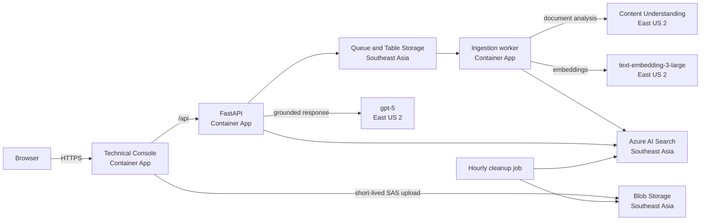

# 90-minute workshop: Content Understanding and grounded RAG

## Audience and outcome

This tutorial is for application developers and cloud engineers. In 90 minutes, participants inspect the architecture, deploy the MVP, upload synthetic content, trace extraction and retrieval, ask a grounded question, and review GitHub delivery controls.

## Safety boundary

Use only synthetic workshop content. Do not upload confidential, regulated, personal, customer, or production information. The smoke test generates a deterministic synthetic PDF in memory, so no fixture download is required.

## Architecture



Application/data resources run in **Southeast Asia**. Microsoft Foundry, Content Understanding, `gpt-5`, and `text-embedding-3-large` run in **East US 2**. Uploaded content and derived evidence cross regions for processing. The runtime model is `gpt-5`; any implementation-agent model mentioned in the historical plan is not an application runtime dependency.

## Agenda

| Time | Activity |
| --- | --- |
| 0–10 min | Review safety, regions, architecture, and keyless identity |
| 10–25 min | Run backend, frontend, Bicep, script, and workflow checks |
| 25–45 min | Deploy with `scripts/deploy.ps1` and inspect ACR/Container Apps |
| 45–65 min | Upload the generated synthetic PDF and inspect extraction/pipeline state |
| 65–75 min | Ask the known revenue question and inspect citations/retrieval diagnostics |
| 75–85 min | Review CI, CodeQL, Copilot review, OIDC, and immutable images |
| 85–90 min | Delete the document, start cleanup, and discuss teardown |

## Exercise 1: Verify the repository

Run the exact checks in the root README. Notice that Python dependencies come from the Microsoft enterprise feed and that Bicep is the only infrastructure language.

## Exercise 2: Deploy

```powershell
az login
./scripts/deploy.ps1 -EnvironmentName cudemo -Subscription <subscription-id>
```

The script builds with ACR Tasks; local Docker is not required. Follow [the deployment guide](../deployment.md) for permissions, quota recovery, cleanup, and removal.

## Exercise 3: Explore the Technical Console

1. Open the printed frontend URL and read the region and safety disclosures.
2. Use the generated smoke PDF, or create equivalent synthetic Contoso content.
3. Observe upload, Content Understanding analysis, chunking, embedding, indexing, and ready states.
4. Inspect category, extracted fields, source locator, vector dimensions, and correlation ID.
5. Ask: **What was Contoso's total revenue for Q3 2026?**
6. Require a grounded answer with a source citation; do not treat an uncited answer as evidence.
7. Delete the document and confirm it disappears immediately from the session.

## Exercise 4: Review GitHub delivery

1. Inspect CI, CodeQL, and deploy workflows under `.github/workflows`.
2. Confirm deployment uses GitHub OIDC and environment variables, not Azure secrets.
3. Inspect `.github/copilot-instructions.md` for the security-focused review policy.
4. Run `scripts/configure-github.ps1` after Bicep creates the GitHub deployment identity.
5. In Task 19, open a pull request and confirm CI, both CodeQL analyses, and Copilot review.

## Finish

Start the hourly cleanup job manually if desired, then remove the workshop environment with `azd down --purge --force`. Do not leave sample resources running unnecessarily; Search, Foundry model capacity, Container Apps, logs, storage, and ACR can incur costs.
